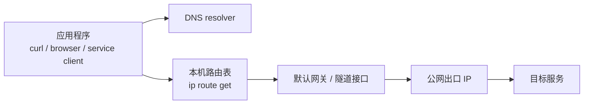

# 第 9 章：可视化网络流

本章学习如何把“访问某个网址或服务”的路径画出来。目标不是画出互联网真实全拓扑，而是把本机可观察到的关键节点串起来：应用、DNS、路由、网关、出口 IP、目标服务。

## 1. 这是什么

网络流可视化是把一次访问拆成可观察步骤，并用图表示出来。

最小模型：



这个图是“从本机视角观察到的路径”，不是运营商或云厂商内部完整拓扑。

## 2. 为什么需要

命令输出对初学者不直观。把输出整理成图，可以更快回答：

- DNS 是谁解析的？
- 本机会从哪个网卡出？
- 下一跳网关是谁？
- 出口 IP 是什么？
- 目标域名解析到哪个 IP？
- 路由路径中是否出现了预期的中继或隧道？

后续做 SSH SOCKS5、WireGuard、Tailscale Exit Node 时，可以用同一张图对比配置前后差异。

## 3. 它解决什么问题

可视化能解决：

- 把零散命令输出整理成同一条阅读路径
- 发现“出口 IP 变了但 DNS 没变”的问题
- 发现“默认路由没走隧道”的问题
- 说明 target、DNS resolver、gateway、egress 的区别
- 给 GitHub 教程提供可读的 Mermaid 图

## 4. 它不能解决什么问题

可视化不能证明：

- 你看到了完整互联网路径
- 所有流量都走同一路径
- 浏览器没有使用独立 DNS
- 目标服务无法识别你
- 中继节点或云厂商没有日志

路径探测命令也可能被中间设备屏蔽、限速或改写。

## 5. 实验步骤

本章对应实验：`labs/lab-05-visualize-flow.md`。

### 5.1 手工采集

以 `https://example.com` 为例：

```bash
TARGET_HOST="example.com"

dig +short A "$TARGET_HOST"
dig +short AAAA "$TARGET_HOST"
ip route get 93.184.216.34
curl -4 https://api.ipify.org
tracepath 93.184.216.34
```

`93.184.216.34` 只是示例，实际应替换成你解析到的目标 IP。

### 5.2 使用脚本生成报告

项目提供一个只读脚本：

```bash
./scripts/flow-map.sh https://example.com
```

保存报告：

```bash
./scripts/flow-map.sh https://example.com > notes/example-flow.local.md
```

`notes/` 已被 `.gitignore` 忽略，避免把真实 IP 和路径误提交。

### 5.3 复制 Mermaid 图

脚本输出中包含：

```text
```mermaid
...
```
```

把这段复制到 GitHub Markdown，GitHub 会直接渲染流程图。

### 5.4 对比不同网络状态

建议分别运行：

```bash
./scripts/flow-map.sh https://example.com > notes/flow-direct.local.md
```

启用 SSH SOCKS5、WireGuard 或 Tailscale Exit Node 后，再运行：

```bash
./scripts/flow-map.sh https://example.com > notes/flow-after-tunnel.local.md
```

对比：

- `Public IPv4`
- `DNS servers`
- `Route`
- `Trace`
- Mermaid 图里的出口节点

## 6. 常见坑

- `tracepath` 不完整，不代表访问失败。
- CDN 域名可能解析到不同 IP，每次图可能不一样。
- `ip route get` 只能展示本机内核选择，不能展示目标服务内部路径。
- 浏览器可能用 DoH，脚本里的 `dig` 只代表系统或命令行 DNS 观察。
- 访问 URL 和访问裸 IP 的路径可能不同，尤其是 HTTPS、SNI、CDN 场景。

## 7. 安全提醒

- 不要公开真实公网 IP、内网网段、主机名、DNS resolver 和 trace 输出。
- 可公开的教程图应使用 `example.com`、`203.0.113.0/24`、`192.0.2.0/24` 等文档示例地址。
- 脚本只读，不会修改路由、防火墙或 DNS。
- 不要用脚本批量探测第三方目标；实验应限制在授权、低频、学习用途。

## 8. 英文关键词

- Network flow
- Mermaid
- Flowchart
- DNS resolution
- Route lookup
- Gateway
- Egress IP
- Tracepath
- Hop
- CDN
- SNI

